# VizzAtt (Team-Project-19)

## Attendance System using Face Recognition

### Introduction
Instead of going through the tiring process of taking attendance during a class, it would get a lot easier for the schools and professors if the time taken for this activity was reduced by using some automation. By the result of automation, professors would get some more time to complete their respective syllabus. One of the ways automation can be carried out is by performing face recognition whenever students enter the classroom. In this way, time can be saved by automating the process of mechanically taking attendance in the classroom.

### Abstract
Our project Vizzat—An Attendance System using Face Recognition—utilizes state-of-the-art face recognition built with deep learning to automate the process of taking class attendance. Our full-fledged web based system, through the UI, provides authenticated faculty users with the controls to manage the registered students in a particular class and section, take the attendance for a particular class section and lecture number, and view the attendance history. By deploying Vizzat, schools will enable their teaching staff to automate the process of taking attendance by monitoring (through an interfaced webcam) and recognizing the students walking into the classroom, which will save precious minutes of lecture time that potentially adds up to hours over the length of the course. Self-experiment results using us four team members registered as part of a class and section showed 100% success, as all four of us were properly marked as “Present.”

### Approach
Our system and application will be a full-fledged web-based application that is largely built around using the Django framework. The backend will be in Python and using the Django framework, and will contain all the functionalities and methods to manage the student and attendance information within the database. To implement the facial recognizer, we will use the facial recognition python library that uses dlib's state-of-the-art facial recognition models (which implement HOG + CNN + SVM machine learning models) directly within our recognizer app as pre-trained models to do recognition on students walking into the frame of the the webcam. We thus have students for each class and section have a training image each inside the directory structure organied by class and section. The database will be SQLite database that contains the "students" table and the "attendance" table, and these will be used as "Django" models to be written and read from. On the front-end, we will provide the authenticated user (aimed to be the instructor or professor) with the controls to add/update a student to a particular class and section, record attendance for a particular class and section and lecture number, and view the attendance history (with ability to filter based on student ID, date, and class period). Recording attendance for a particular class will update the "attendance" table (with each student in the class marked present or absent based on if they were recognized), and also send the attendance sheet (excel sheet) to the instructor's email.

### Persona
Different schools, offices, and universities can be considered as the target audience of this project. While the project is aimed at the school level, inspiration is gained from wanting to ease the instructor's QoL by allowing them to avoid the tedious manual process of attendance taking, especially if the classes are large in size and students may sit anywhere within the lecture hall.

### Running Web Application Screenshots

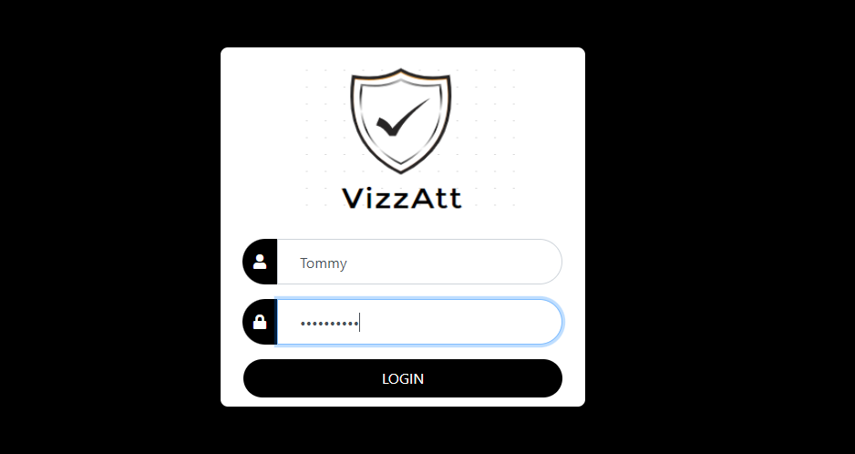

Login page

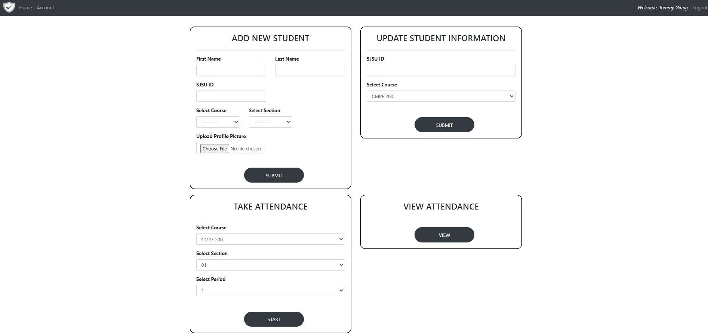

Home page

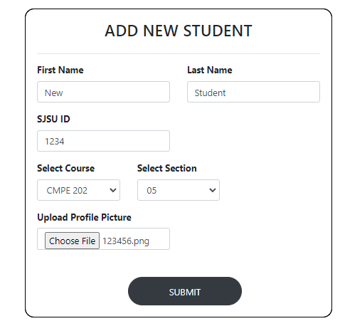
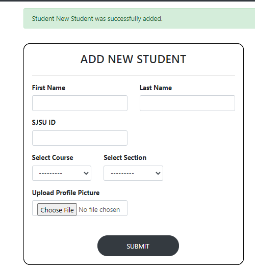

Adding a new student named "New Student" with ID 1234 to CMPE 202 section 05, and with a profile picture.

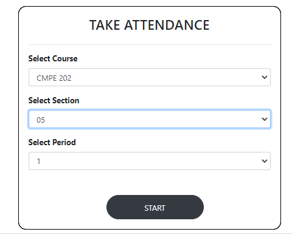

Taking the attendance for that course and section. This will trigger monitoring the webcam and recognizing the people in the image frame if they are highly similar to one of the training images of the registered students in that course and section.

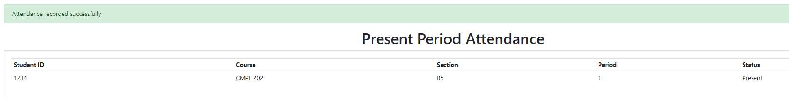

Attendance done taken. New Student successfully recognized.

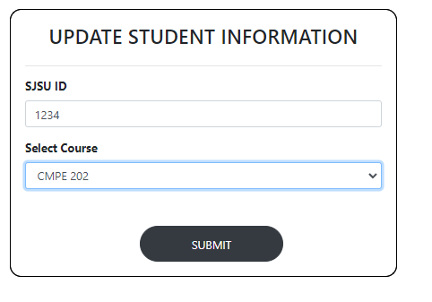
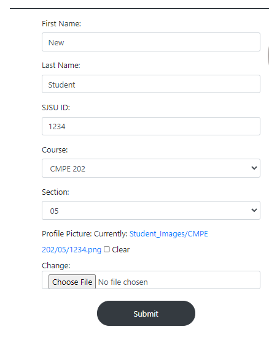

Update a student's information.

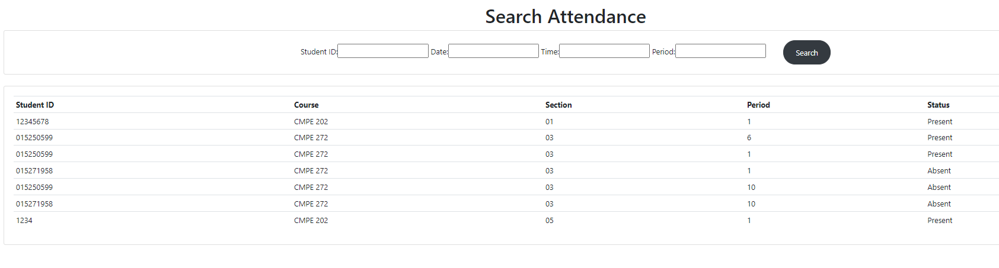

Search the attendance history.

### Database Screenshots

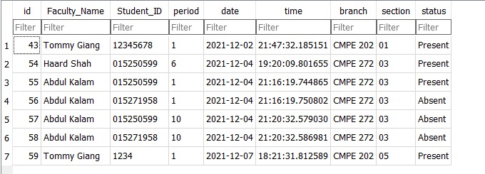

Attendance table

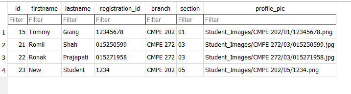

Students table

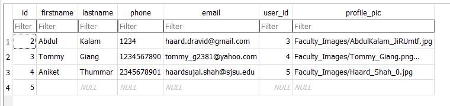

Faculty table
